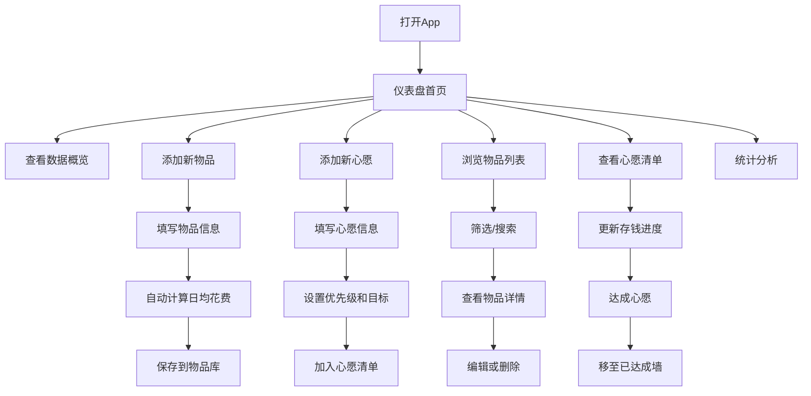

## 1. 产品概述

"物惜"是一款个人物品价值管理与心愿清单App，帮助用户追踪数码产品、家居用品等的使用成本，并管理心愿购物清单。

- 核心价值：让每一分钱花得明明白白，记录物品的真实使用价值
- 目标用户：数码爱好者、生活品质追求者、理性消费者
- 使用场景：购买决策、物品盘点、消费反思、心愿达成

## 2. 核心功能

### 2.1 功能模块

1. **仪表盘首页**：数据概览、统计卡片、快捷操作
2. **物品管理**：物品录入、分类、编辑、删除、日均花费计算
3. **心愿清单**：心愿录入、优先级、进度追踪、已达成标记
4. **统计分析**：分类占比、花费趋势、性价比排行
5. **设置**：数据管理、主题切换

### 2.2 页面详情

| 页面名称 | 模块名称 | 功能描述 |
|---------|---------|---------|
| 仪表盘 | 顶部问候 | 显示日期和问候语 |
| 仪表盘 | 统计卡片 | 总物品数、总花费、本月新增、心愿数量 |
| 仪表盘 | 快捷入口 | 添加物品、添加心愿按钮 |
| 仪表盘 | 最近物品 | 最近添加的5个物品列表 |
| 仪表盘 | 心愿进度 | 进行中的心意向导展示 |
| 物品列表 | 分类筛选 | 数码/家居/服饰/其他分类切换 |
| 物品列表 | 物品卡片 | 名称、价格、使用天数、日均花费 |
| 物品列表 | 搜索功能 | 按名称搜索物品 |
| 物品详情 | 物品信息 | 完整信息展示、使用时长计算 |
| 物品详情 | 编辑/删除 | 修改信息或删除物品 |
| 新增物品 | 表单录入 | 名称、分类、价格、购买日期、备注、图片 |
| 心愿清单 | 心愿列表 | 按优先级排列的心愿卡片 |
| 心愿清单 | 进度追踪 | 存钱进度条、达成百分比 |
| 心愿清单 | 已达成区 | 已实现的心愿展示墙 |
| 新增心愿 | 表单录入 | 名称、价格、优先级、目标日期、备注 |
| 统计页面 | 分类饼图 | 各分类物品数量/金额占比 |
| 统计页面 | 趋势图 | 月度花费趋势折线图 |
| 统计页面 | 排行榜 | 日均花费最高/最低排行 |
| 设置页面 | 数据导出 | 导出JSON备份 |
| 设置页面 | 主题切换 | 深色/浅色主题 |
| 设置页面 | 关于 | App信息 |

## 3. 核心流程

## 4. 用户界面设计

### 4.1 设计风格

**设计理念：温暖、精致、有生活气息**

- **主色调**：暖橙色系（#FF8C42 为主），传递温暖与活力
- **辅助色**：薄荷绿（#4ECDC4）用于心愿和积极指标
- **中性色**：暖灰白色背景，深灰文字，柔和不刺眼
- **按钮风格**：圆角胶囊形，微渐变，悬停有轻微上浮效果
- **卡片风格**：大圆角（16px），柔和阴影，白色/浅灰卡片
- **字体**：使用现代无衬线字体，标题加粗，正文轻盈
- **图标风格**：线性图标，搭配表情符号增添趣味

### 4.2 页面设计概览

| 页面名称 | 模块名称 | UI元素 |
|---------|---------|--------|
| 仪表盘 | 统计卡片 | 渐变背景图标、数值动画、趋势箭头 |
| 仪表盘 | 最近物品 | 横向滚动卡片、分类标签 |
| 仪表盘 | 心愿进度 | 进度条动画、百分比展示 |
| 物品列表 | 分类Tab | 下划线切换、胶囊形选中态 |
| 物品卡片 | 信息布局 | 左图标右文字，底部日均花费高亮 |
| 新增页面 | 表单样式 | 分组卡片、浮动标签、大输入框 |
| 心愿卡片 | 优先级标识 | 不同颜色边框/角标 |
| 心愿卡片 | 进度条 | 渐变色进度条、脉冲动画 |
| 统计页面 | 图表区 | 圆形饼图、渐变折线 |
| 设置页面 | 列表项 | 左图标右箭头、分组间隔 |

### 4.3 响应式设计

- **移动优先**：针对手机端优化，适配鸿蒙系统
- **底部导航**：5个Tab导航（首页、物品、心愿、统计、我的）
- **手势支持**：左滑删除、下拉刷新、捏合缩放图片
- **触控优化**：按钮最小44x44px，间距充足
- **横竖屏适配**：平板设备双栏布局

### 4.4 动效与交互

- 页面切换：左右滑动过渡
- 卡片入场：渐入+上移动画，错落延迟
- 按钮点击：缩放反馈（scale 0.95）
- 进度条：从0到目标值的平滑动画
- 数字变化：滚动数字动画效果
- 下拉刷新：弹性动画+loading图标旋转
- 空状态：可爱插画+鼓励文案
