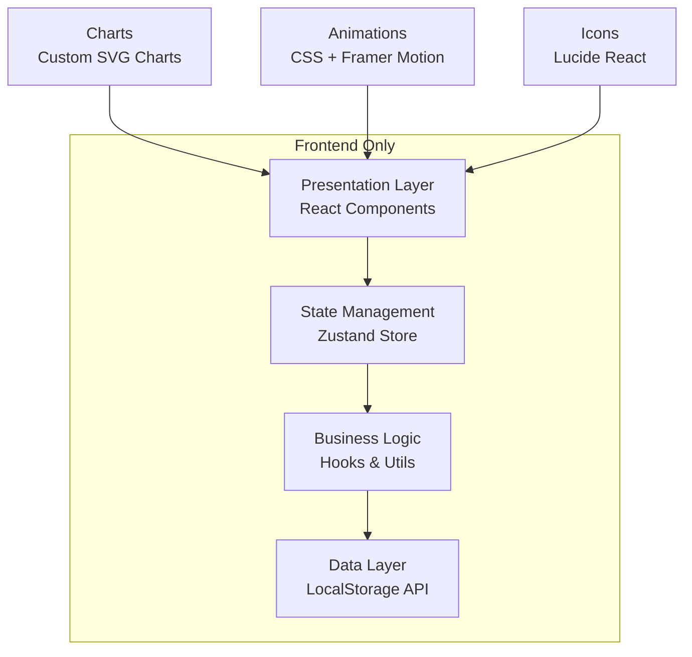
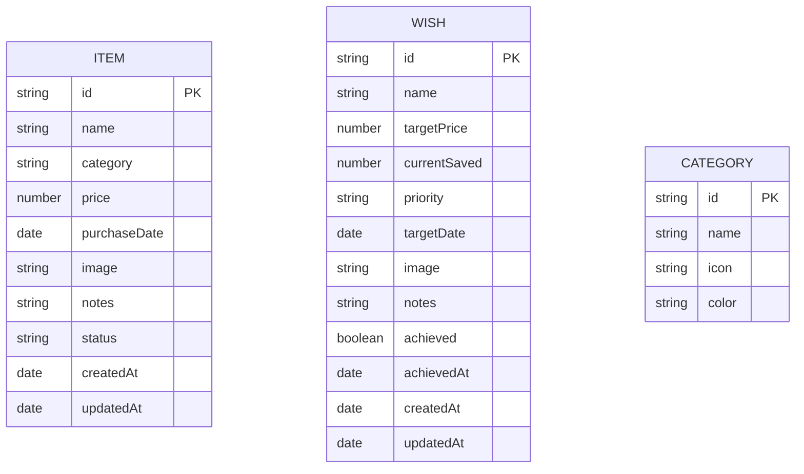

## 1. 架构设计



## 2. 技术说明

- **前端框架**：React 18 + TypeScript
- **构建工具**：Vite
- **样式方案**：Tailwind CSS 3
- **状态管理**：Zustand
- **路由管理**：React Router DOM
- **图标库**：Lucide React
- **动画**：CSS transitions + 自定义动画
- **图表**：原生SVG实现（轻量级，无第三方依赖）
- **数据存储**：LocalStorage（纯前端，无需后端）
- **PWA支持**：可安装到鸿蒙桌面

## 3. 路由定义

| 路由 | 页面 | 说明 |
|------|------|------|
| `/` | 仪表盘首页 | 数据概览、快捷操作 |
| `/items` | 物品列表 | 物品管理、分类筛选 |
| `/items/new` | 新增物品 | 物品录入表单 |
| `/items/:id` | 物品详情 | 物品信息展示与编辑 |
| `/wishes` | 心愿清单 | 心愿列表与进度 |
| `/wishes/new` | 新增心愿 | 心愿录入表单 |
| `/stats` | 统计分析 | 图表与排行榜 |
| `/settings` | 设置 | 数据管理与偏好 |

## 4. 数据模型

### 4.1 数据模型定义



### 4.2 数据类型定义

```typescript
// 物品分类
type Category = 'digital' | 'home' | 'clothing' | 'other';

// 物品状态
type ItemStatus = 'active' | 'idle' | 'sold';

// 物品
interface Item {
  id: string;
  name: string;
  category: Category;
  price: number;
  purchaseDate: string; // ISO date string
  image?: string;
  notes?: string;
  status: ItemStatus;
  createdAt: string;
  updatedAt: string;
}

// 心愿优先级
type WishPriority = 'high' | 'medium' | 'low';

// 心愿
interface Wish {
  id: string;
  name: string;
  targetPrice: number;
  currentSaved: number;
  priority: WishPriority;
  targetDate?: string;
  image?: string;
  notes?: string;
  achieved: boolean;
  achievedAt?: string;
  createdAt: string;
  updatedAt: string;
}

// 分类配置
interface CategoryConfig {
  id: Category;
  name: string;
  icon: string;
  color: string;
}

// App设置
interface AppSettings {
  theme: 'light' | 'dark' | 'auto';
  currency: string;
  dateFormat: string;
}
```

## 5. 项目结构

```
src/
├── components/          # 可复用组件
│   ├── layout/         # 布局组件
│   │   ├── BottomNav.tsx
│   │   ├── PageHeader.tsx
│   │   └── TabBar.tsx
│   ├── items/          # 物品相关组件
│   │   ├── ItemCard.tsx
│   │   ├── ItemForm.tsx
│   │   └── CategoryFilter.tsx
│   ├── wishes/         # 心愿相关组件
│   │   ├── WishCard.tsx
│   │   ├── WishForm.tsx
│   │   └── ProgressBar.tsx
│   ├── stats/          # 统计图表组件
│   │   ├── PieChart.tsx
│   │   ├── LineChart.tsx
│   │   └── StatCard.tsx
│   └── common/         # 通用组件
│       ├── Button.tsx
│       ├── Input.tsx
│       ├── Modal.tsx
│       └── EmptyState.tsx
├── pages/              # 页面组件
│   ├── Dashboard.tsx
│   ├── Items.tsx
│   ├── ItemDetail.tsx
│   ├── NewItem.tsx
│   ├── Wishes.tsx
│   ├── NewWish.tsx
│   ├── Stats.tsx
│   └── Settings.tsx
├── store/              # 状态管理
│   ├── useItemStore.ts
│   ├── useWishStore.ts
│   └── useSettingsStore.ts
├── hooks/              # 自定义Hooks
│   ├── useLocalStorage.ts
│   └── useDateUtils.ts
├── utils/              # 工具函数
│   ├── date.ts
│   ├── calculation.ts
│   └── storage.ts
├── types/              # 类型定义
│   └── index.ts
├── data/               # 静态数据与Mock
│   ├── categories.ts
│   └── mockData.ts
├── styles/             # 全局样式
│   └── globals.css
├── App.tsx
├── main.tsx
└── index.css
```

## 6. 核心计算逻辑

### 6.1 日均花费计算

```
日均花费 = 物品价格 / 使用天数
使用天数 = 当前日期 - 购买日期
```

### 6.2 月均花费

```
月均花费 = 日均花费 * 30
```

### 6.3 分类统计

```
分类总金额 = 该分类所有物品价格之和
分类占比 = 分类总金额 / 总金额 * 100%
```

### 6.4 心愿进度

```
进度百分比 = 当前已存 / 目标价格 * 100%
剩余金额 = 目标价格 - 当前已存
```

## 7. 鸿蒙适配方案

- **PWA模式**：添加manifest.json和service worker，支持"添加到桌面"
- **鸿蒙字体**：使用鸿蒙系统字体HarmonyOS Sans
- **触控优化**：针对鸿蒙手势导航优化底部安全区
- **状态栏适配**：沉浸式状态栏，适配刘海屏/挖孔屏
- **分享集成**：支持鸿蒙系统分享面板
